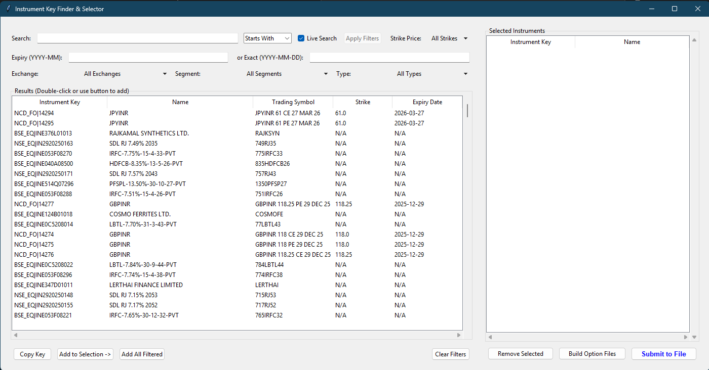
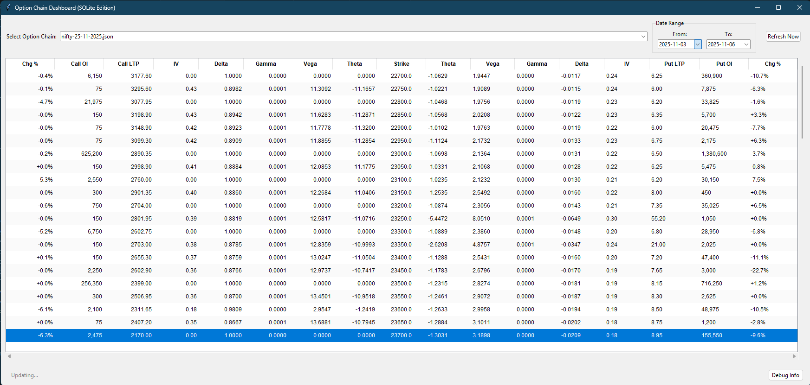
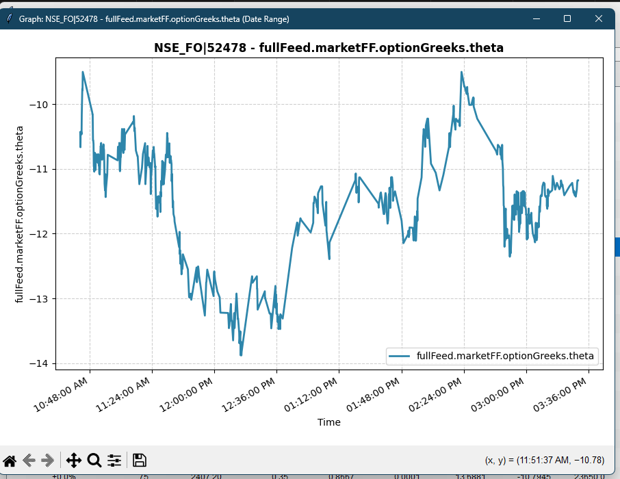

# 📈 Real-Time Market Data and Option Chain Dashboard (Upstox API)

A robust **Python data pipeline** for continuous market data ingestion, storage, and dynamic visualization.

---

## 📘 Overview

This project is a **complete data pipeline solution** built in Python, designed to capture, store, and visualize **real-time tick-by-tick market data** from the Upstox API.  
It focuses on resilience and automation, featuring a **fully managed token lifecycle** and a **multi-threaded architecture** to ensure continuous, high-fidelity data logging into an optimized SQLite database.

The application culminates in an **interactive Option Chain Dashboard (GUI)** that allows users to analyze live market Greeks (Delta, Gamma, Theta, Vega), Open Interest (OI), and Last Traded Price (LTP), with the ability to plot **historical trends** over custom date ranges.

---

## ⚙️ Key Features

- ⚡ **Real-Time Data Ingestion**  
  Uses the Upstox WebSocket API to stream tick-by-tick market data, including Greeks and OI, storing it for long-term analysis.

- 🔑 **Automated Token Management**  
  Implements a multi-step process (`a_token_req.py` and `req_token.py`) to securely handle the daily OAuth flow, ensuring the required `A_TOKEN` is generated and retrieved for continuous market access.

- 💾 **High-Volume Storage**  
  Data is logged into a dedicated SQLite database (`resources/live_data.db`) with appropriate indexing for fast retrieval and query execution.

- 🔍 **Instrument Finder (GUI)**  
  A Tkinter utility (`search.py`) to easily filter the entire Upstox instrument universe and select specific instrument keys for tracking.

- 📊 **Interactive Dashboard**  
  A Tkinter/Matplotlib GUI (`dashboard.py`) for live Option Chain analysis and historical charting, allowing users to select any metric (LTP, OI, Delta, etc.) and plot its history.

- ⏰ **Scheduler / Watchdog**  
  The `run.py` manager uses **apscheduler** to automatically execute the full workflow (Token → Fetcher → Dashboard) exclusively during Indian market hours (9:15 AM – 3:31 PM IST).

---

## 🧠 Tech Stack

| Category | Tools & Libraries |
|-----------|------------------|
| **Language** | Python 3.10+ |
| **API** | Upstox API (WebSocket & REST) |
| **Data Storage** | SQLite (`live_data.db`) |
| **Data Ingestion** | `requests`, `websockets`, `google-protobuf` |
| **Automation** | `apscheduler`, `pytz`, `subprocess` |
| **Visualization / GUI** | `tkinter`, `matplotlib`, `tkcalendar` |

---

## 📂 Folder Structure

```
.
├── .env                    # Environment variables (API Keys, Client IDs, Access Token)
├── .gitignore              
├── complete.json           # Full list of tradable instruments (Prerequisite file)
├── a_token_req.py          # Initiates the Access Token generation process
├── req_token.py            # Retrieves and saves the Access Token from the 
├── create_db.py            # Initializes the SQLite database and `ticks` table
├── fetch_data.py           # CORE: WebSocket data ingestion and database writer
├── run.py                  # The Watchdog/Scheduler for automated daily execution
├── search.py               # Tkinter GUI for instrument key selection
├── dashboard.py            # Tkinter/Matplotlib GUI for Option Chain visualization
├── requirements.txt        
├── logs/
│   ├── dashboard.log  
│   ├── fetch_data.log
│   └── manager.log   
├── notifier-endpoint/ 
│   ├── package.json 
│   ├── package-lock.json
│   └──api/
│       └── notifier.js      # Vercel deployable file for the storing of access token as an endpoint
│
│   
└── resources/
    ├── instruments.txt     # List of keys to track (input for fetch_data.py)
    ├── instruments_details.json  # Detailed metadata of tracked instruments
    ├── nifty-25-11-2025.json     # CE/PE mapping for NIFTY Option Chain
    ├── sensex-25-11-2025.json    # CE/PE mapping for SENSEX Option Chain
    └── live_data.db        # The central database for all tick data
```

---

## 🧾 Supporting Data Files

These files are automatically generated or used internally by the system to handle instrument data, mappings, and market storage.

| File | Description |
|------|--------------|
| **📄 stock-exipry.json** | Generated by `search.py`. These files store structured mappings of strike prices to their corresponding **Call (CE)** and **Put (PE)** instrument keys for the given expiry date. Example: each entry like `"24600.0": { "CE": "NSE_FO\|52749", "PE": "NSE_FO\|52758" }` represents a strike with both its option instruments. |
| **📄 instruments_details.json** | A detailed metadata file containing full instrument specifications — including expiry date, trading symbol, strike price, lot size, instrument type (CE/PE), and exchange token. It serves as the reference backbone for mapping instrument keys to real-world contract details. |
| **📄 instruments.txt** | A list of all active instrument keys (e.g., `NSE_FO\|52758`, `BSE_FO\|874785`, etc.) selected by the user. These keys define which instruments are fetched by `fetch_data.py`. |
| **💾 live_data.db** | The central SQLite database that stores all real-time tick data, including Greeks, LTP, OI, and timestamps. This file grows continuously during live trading hours and powers all historical visualizations in `dashboard.py`. |

---

## 🚀 How to Run

### 1. Initial Setup

**Get Credentials**  
Obtain your `Client ID (C_ID)` and `Client Secret (C_SEC)` from the **Upstox Developer Portal**.

**Notifier Endpoint**  
You’ll need a hosted service (e.g., **Vercel**) to manage the secure callback URL during the OAuth flow.  
Set its URL as `ENDPOINT` in your `.env`.

**Install Dependencies**
```bash
pip install -r requirements.txt
```

**Configure .env**  
Create a file named `.env` in the root directory and set your credentials.  
Leave `A_TOKEN` blank for the first-time setup.
```env
A_TOKEN=""
C_ID="your_client_id_here"
C_SEC="your_client_secret_here"
ENDPOINT="your_vercel_notifier_url_here/api"
```

**Create Database**
```bash
python create_db.py
```

---

### 2. Daily Workflow (Manual Execution)

**Generate Token Request**
```bash
python a_token_req.py
```
This initiates the Upstox OAuth flow.

**Retrieve Token**
Once the OAuth flow completes, run:
```bash
python req_token.py
```
This updates your local `.env` file with the new `A_TOKEN`.

**Select Instruments**
```bash
python search.py
```
Use the visual instrument finder to choose the instruments you want to track.

**Start Data Pipeline & Dashboard**

Terminal 1 – Data Ingestion:
```bash
python fetch_data.py
```

Terminal 2 – Visualization:
```bash
python dashboard.py
```

---

### 3. Automated Execution (Recommended)

To streamline the daily market data process, use the scheduler:

```bash
python run.py
```

This automatically handles:
- Token generation and refresh
- Starting the data fetcher
- Launching the dashboard (during 9:15 AM – 3:31 PM IST)

Logs are saved in the `/logs` folder.

To stop cleanly:
```
CTRL + C
```

---

## 📊 Screenshots

| Component | Description |
|------------|-------------|
| **Instrument Finder** | Tkinter GUI for filtering the instrument universe and selecting specific keys. |
| **Option Chain Dashboard** | Displays live metrics (LTP, OI, Greeks) for tracked option strikes, updating in real time. |
| **Historical Charting** | Matplotlib chart showing historical movement of Delta/Vega/LTP over selected date ranges. |


 



## 👤 Author 

**Sarthak Suri**  
Student developer passionate about **Software Engineering**.  

